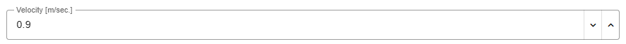
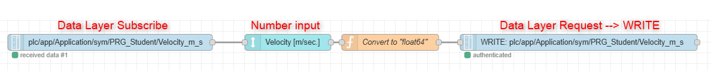
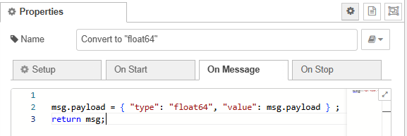

<h1 align="left">
  <br>
  
  <br>
  Industrial Automation Base
  <br>
</h1>

Course AutB

Author: [Cédric Lenoir](mailto:cedric.lenoir@hevs.ch)
> Version 2026, V1.0 

# LAB 06 
## PackML & PLCopen


## Objectifs
-   [ ] Utiliser des Function Block du type PLCopen dans un contexte PackML.
-   [ ] Implémenter des alarmes et des warnings pour surveiller le système.

## Règles de codage
-   Vous devez programmer uniquement dans **PRG_Student**.
-   Le projet comporte déjà des blocs remplissant un certain nombres de fonctionnalités (gestion des états du PackML, la mise sous tension des axes, etc.)


## Documentation

-   [For Gripper Function Blocks online](FB_Gripper.md)
-   [HEVS PackTag User Interface](HEVS_PackTag_UI.md)
-   [HEVS Alarms](FB_HEVS_SetAlarm.md)
-   [HEVS Warnings](FB_HEVS_SetWarning.md)
-   [MC_Stop & MC_MoveAbsolute](MC_MoveAbsolute_AND_MC_Stop.md)


### Sécurité
L'axe Z est déjà programmé pour remonter pendant l'état "Resetting" afin d'éviter les risques de Crash.

Vous pouvez vous inspirer du code ci-dessous pour implémenter votre programme : **FB_ModuleAxis_Z** utilise **ACT_Resetting**.
```iecst
(*
	Manage Resetting
*)
IF actualState = E_PackState.eResetting THEN
   // Set to TRUE if no action requested
   CASE axisResetting OF
      E_AxisResetting.eIdle :
         // For Z axis, position 0 is safe
         mcMoveAbs.Position := 0;
         axisResetting := E_AxisResetting.eMotionResetPos;
		
      E_AxisResetting.eMotionResetPos :
         IF mcMoveAbs.Done THEN
            axisResetting := E_AxisResetting.eMotionIdleDone;
         ELSIF mcMoveAbs.Error THEN
            axisResetting := E_AxisResetting.eMotionIdleError;
         END_IF
      E_AxisResetting.eMotionIdleDone :
         // Do Nothing, SC
         ;
      E_AxisResetting.eMotionIdleError :
         // Do nothing, wait for debug
         ;		
   END_CASE
	
   stActing.Resetting_SC := (axisResetting = E_AxisResetting.eMotionIdleDone);
ELSE
   axisResetting := E_AxisResetting.eIdle;	
   stActing.Resetting_SC := FALSE;
END_IF

```

L'instance du FB ``MC_MoveAbsolute`` (par exemple : ``mcMoveAbs``) est appelée en dehors de la State Machine afin de ne jamais rester dans un état indéterminé.

Exemple :

```iecst
mcMoveAbs.Execute := (axisResetting = E_AxisResetting.eMotionResetPos);
mcMoveAbs(Position := 100,
          Velocity := 0.1,
          Acceleration := 1,
          Deceleration := 1);

```


### Etat réservé
L'état Execute en mode Manuel est réservé pour le mode "jog".
Vous pouvez utiliser les autres états et modes.

### Principe PackML "HES-SO Valais-Wallis"
Le PackML développé au sein de la HES-SO Valais-Wallis gère automatiquement les états.
**ACT_PackManager** et réservé pour la gestion du module.

Vous ne codez que dans les actions des états qui sont nécessaires.


### Implémentation des alarmes et des warnings
Vous appelez vos Warnings et Alarmes dans **ACT_WarningAndAlarms**. Voir dans [documentation](#documentation) les exemples de code.

### A propos du Gripper
Le gripper est programmé pour être pilotable manuellement, sauf dans les conditions suivantes:

```iecst
IF NOT ((PackTag.hevsUI.uiStateExecute AND (PackTag.Status.UnitModeCurrent = E_PackModes.Production)) OR
         PackTag.hevsUI.uiStateClearing  OR
         PackTag.hevsUI.uiStateResetting)    THEN
	fbOpenGripper.Execute := stTestFbGripperHmi.openGripper;
	fbCloseGripper.Execute := stTestFbGripperHmi.closeGripper;	
END_IF

```
Ce qui signifie que les blocs fonctionnels "FB_OpenGripper" et "FB_CloseGripper" peuvent être utilisés dans tous les autres états.


## URS User Request Specification


|URS ID |Specification|
|-------|-------------|
|0. |**Starting**|
|0.1   |Dans cet état, les axes X et Z vont se positionner aux positions **X = -100** et **Z = 100**.|
|0.2   |Quand les deux axes sont en position, on passe en Execute.|
|1. |**Execute**|
|1.1 |Les axes X et Z doivent se déplacer selon le tableau et [dessin ci-dessous](#details-for-square).|
|1.2. |On peut modifier la vitesse, l'accélération et le jerk depuis le HMI Node-RED.|
|1.3. |Le gripper est activé selon le [tableau ci-dessous](#details-for-square).|
|1.4. |Le mouvement s'exécute en boucle, 1-2-3-4-1...|
|2. |**Hold**|
|2.1 |Si on appuie sur le bouton Hold du HMI Node-RED, les axes sont stoppés immédiatement avec le FB_Stop.|
|2.2 |Si on appuie sur le bouton Unhold du HMI Node-RED, le système recommence la séquence Execute.|
|3. |**Suspend**|
|3.1. |Après 3 cycles de mouvements, le programme passe en Suspended pendant 3 secondes, puis recommence pour 3 cycles supplémentaire et ainsi de suite.|
|3.2. |L'action Suspended doit être activée par une **alarme** de niveau Suspend.|
|4. |**Warnings**|
|4.1. |En Aborted, on indique qu'il faut un clearing pour démarrer.|
|4.2. |En Stopped, on indique qu'il faut un reset pour démarrer.|
|4.3. |En Held, on indique qu'il faut un unhold pour démarrer.|
|5. |**Alarm Gripper**|
|5.1 |Si on coupe l'air comprimé et que le gripper ne se ferme pas, on génère une alarme de niveau Stoppe avec un message.|
|5.2 |Si on coupe l'air comprimé et que le gripper ne s'ouvre pas, on génère une alarme de niveau Stoppe avec un message.|


### Details for Square

|Id |Move To Position X|M.T.P Z |Action      |Delay [ms] |Next Id|
|---|------------------|--------|------------|-----------|-------|
|1  |0                 |50      |eOpen       |500        |2      |
|2  |0                 |-50       |eClose      |0          |3      |
|3  |100               |-50       |eOpen       |0          |4      |
|4  |100               |50      |eClose      |0          |1      |
|1  |0                 |50      |eOpen       |500        |2      |

-  Velocity_m_s        := 0.05;
-  Acceleration_m_s2   := 1;
-  Deceleration_m_s2   := 1;
-  Jerk_m_s3           := 10;

<div style="text-align: center;">
<figure>
    
    <figcaption>2D motion with a square</figcaption>
</figure>
</div>


### About Programs


Function blocks for robot are in **HEVS_Robot**.

Manual motions are set in **HEVS_UnitBox** -> **PRG_Process**.

**PRG_Student** is called in **PRG_Process**.

#### About SC State Complete
The synthesis of modules for the process/Unit are here in **ACT_Build_Pack_SC** of the program **PRG_Process**.

```iecst
(*
	This section should group all EM and CM State Complete
	This Unit_SC is used by PLC_PACK to manager
	States SC
*)
xProcess_SC := fbModuleAxis_X.SC AND
               fbModuleAxis_Y.SC AND
               fbModuleAxis_Z.SC AND
               PRG_Student.SC;
```

#### In the task manager
Only one program is in the task manager it calls all other programs of the Unit Box. PRG_UnitBox.

```iecst
(*
	Check and init program
*)
uliLoopUnitBox := uliLoopUnitBox + 1;
IF NOT xInitUnitBox THEN
	xInitUnitBox := TRUE;
END_IF

(*
	Map program
	Specific to this hardware.
	Mainly access to IO via Profinet and S7-1500
*)
PRG_MapBox();

(*
	Device Manager
	Processing of hardware values.
	May include alarms if devices not included in process
	Ideally, Alarms should be only part of EM and CM in PRG_Process 
*)
PRG_DeviceManager();

(*
	Tools for processing
	Include
		Pack States and Modes
		Alarms
		Date and Time
*)
PLC_PACK();
PRG_TestAlarm();
PRG_GetTime_CtrlX();

(*
	Process
	Management of Unit, EM and CM if any
*)
PRG_Process();
```

</br>
</br>

### Affichage / Modification des paramètres depuis Node-RED
</br>

Exemple pour la vitesse : 

</br>

<div style="text-align: center;">
<figure>
    
    <figcaption>Dashboard 2 , number input</figcaption>
</figure>
</div>


</br>
</br>

<div style="text-align: center;">
<figure>
    
    <figcaption>Subscribe - Input - Conversion - Write</figcaption>
</figure>
</div>

</br>
</br>

<div style="text-align: center;">
<figure>
    
    <figcaption>function : Convert to "float64"</figcaption>
</figure>
</div>


